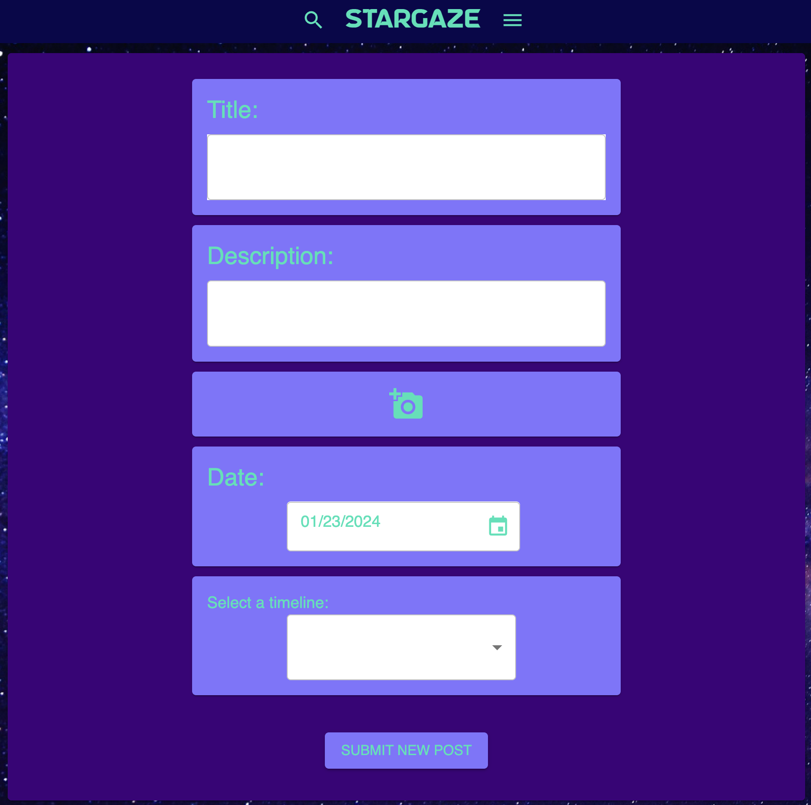

# StarGaze
### Description
StarGaze is an app for capturing memories. Instead of all those magical moments being lost in the never-ending stream of our technological life, 
StarGaze allows you to capture special moments so you can revisit and remember them outside of the bluster and horn-blowing of social media.

The app enables you to create multiple timelines of memories that you can scroll or search through, to explore where you've been and how far you've come. 
Your memories aren't made to be shared, they're just for you. You can create or delete timelines, or simply turn them off if you'd like to focus on one in particular. You can also create or delete or edits your posts as well. Once you create posts, they're instantly populated on the timeline according to whatever date you select.

The app is designed for you, for private use, without the pressure and performative nature of social media. There are no likes to worry about here, no judgmental comments
from the person you haven't seen since high school. Just you and your memories, the wonder that's keeping the stars apart.

### Screenshot

### Technologies Used:
- Javascript
- React
- Redux
- Sagas
- Node.js
- Express
- PostgreSQL
- Material UI
- Passport
- Cloudinary
- sweetalert2
- moment

### Steps Taken to Build This Project

A brief overview:
- [x] Create To Do List
- [x] Create database + link to project
- [x] Create database file in project and create tables
- [x] Add Cloudinary for uploading photos/videos
- [x] React Components:
	- [x] Login page - Already exists
		- [x] Username input
		- [x] Password input
		- [x] Submit button (to Grand Timeline)
	- [x] New User Register - Already exists
		- [x] Username input
		- [x] Password input
		- [x] Submit button (returns to login)
	- [x] Grand Timeline/Dashboard
		- [x] Fetch posts from visible timelines ( GET request )
	- [x] Timelines
		- [x] Button to toggle visibility (PUT request)
		- [x] Delete button (DELETE request)
		- [x] Create New button (to Create New Timeline)
	- [x] Create New Timeline
		- [x] Timeline name input
		- [x] Create button (POST request, back to Timelines page, GET request for all timelines)
	- [x] PostItem
		- [x] Inside Grand Timeline
		- [x] Mapping over all posts connecting to a timeline
		- [x] Post is clickable to take you to the Details page
	- [x] Add New / Create PostItem
		- [x] Textfield input
		- [x] Title input
		- [x] Date input (default value)
		- [x] Notes input 
		- [x] Timeline dropdown 
		- [x] Submit button (Takes back to Grand Timeline, POST request, GET request on Grand Timeline)
	- [x] Details/Edit page ('/:id')
		- [x] Textfield input
		- [x] Title input
		- [x] Date input (default value)
		- [x] Notes input
		- [x] Timeline dropdown
		- [x] Save button
	- [x] Server Routes:
		- [x] Timeline router
		- [x] Post router

### Acknowledgements
I could not have done this without the amazing support of Prime Digital Academy, the amazing members of my cohort, and the support of my family and friends. They have all been incredible.

### Support
If you have suggestions or issues, feel free to email me at chris dot cantoni @ gmail